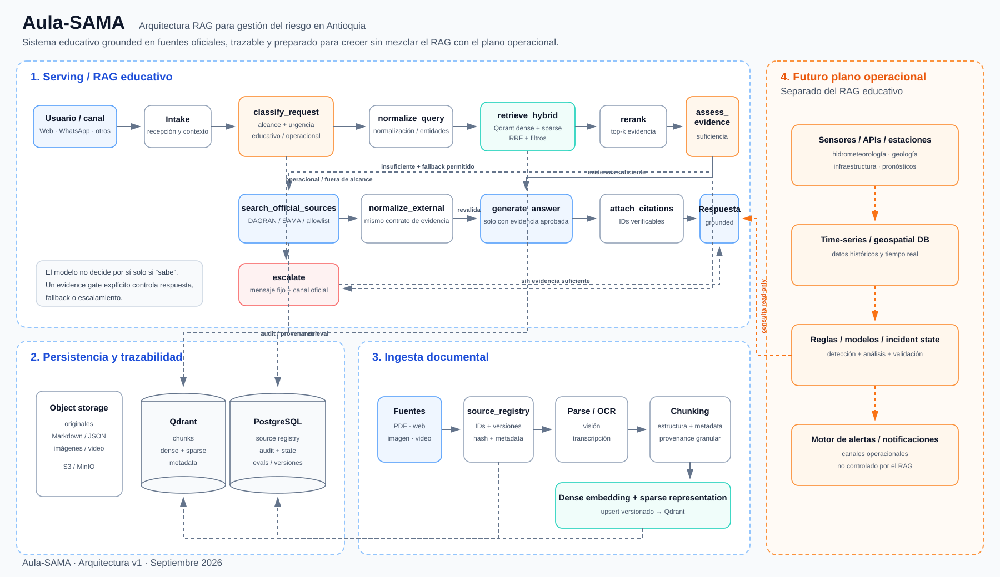

# Aula-SAMA

Aula-SAMA es un asistente educativo basado en RAG para apoyar a la comunidad general en la comprensión de la gestión del riesgo y el monitoreo de amenazas en Antioquia, inicialmente en temas como inundaciones, movimientos en masa y avenidas torrenciales.

El proyecto prioriza cuatro propiedades: **grounding en fuentes oficiales**, **trazabilidad**, **abstención segura cuando la evidencia no es suficiente** y **capacidad de evolución sin mezclar el RAG educativo con un futuro sistema operacional de alertas**.

## Arquitectura propuesta



La arquitectura detallada, decisiones técnicas y criterios de evolución están en [`docs/1_architecture.md`](docs/1_architecture.md). La fuente editable del diagrama está en [`docs/diagrams/aula-sama-architecture.mmd`](docs/diagrams/aula-sama-architecture.mmd).

## Stack recomendado

- **Orquestación:** LangGraph.
- **Vector store:** Qdrant con vectores dense + sparse y fusión RRF como baseline.
- **Embeddings:** Voyage AI, modelo configurable; comenzar con `voyage-4` y evaluar una variante mayor si la mejora justifica costo/latencia.
- **Reranking:** Voyage, modelo configurable y fijado por configuración.
- **LLM:** Claude API para generación grounded y tool use controlado por el grafo.
- **Estado conversacional:** `InMemorySaver` en desarrollo; `PostgresSaver` en producción.
- **Persistencia documental:** almacenamiento de originales + registro de fuentes/versiones separado de Qdrant.
- **Observabilidad:** trazas del grafo, retrieval, fuentes utilizadas, abstenciones y evaluaciones offline.

## Principios de diseño

1. El LLM **no es el componente que decide por sí solo** si una respuesta tiene soporte suficiente.
2. No se usa un único score de “confianza” arbitrario; la suficiencia se calibra con un conjunto de evaluación.
3. Las fuentes externas se consultan mediante un nodo/tool explícito y auditable.
4. Qdrant sirve para recuperación; no sustituye un registro de fuentes ni el almacenamiento de los documentos originales.
5. El sistema educativo puede crecer hacia más herramientas, pero un futuro sistema operacional de alertas se implementa como una **capa de eventos independiente**.

## Estructura objetivo del repositorio

```text
.
├── README.md
├── docs/
│   ├── 1_architecture.md
│   └── diagrams/
│       ├── aula-sama-architecture.mmd
│       └── aula-sama-architecture.svg
├── src/
│   └── aula_sama/
│       ├── graph/
│       ├── retrieval/
│       ├── ingestion/
│       ├── tools/
│       ├── prompts/
│       └── models/
├── evals/
├── tests/
└── .env.example
```

## Estado

Arquitectura propuesta y lista para comenzar implementación. Antes de fijar umbrales y modelos definitivos se debe construir un pequeño conjunto de evaluación con preguntas reales de la comunidad y documentos oficiales del corpus inicial.
