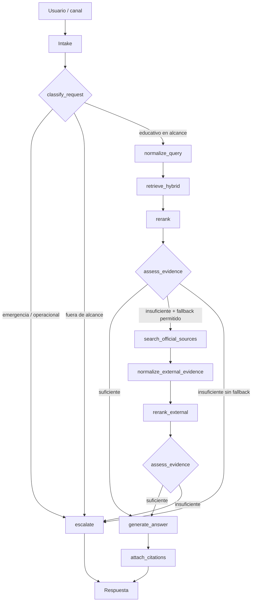

# 1. Arquitectura — Aula-SAMA

## 1. Propósito

Aula-SAMA es un sistema RAG educativo para la comunidad general, enfocado inicialmente en gestión del riesgo y monitoreo de amenazas en Antioquia: inundaciones, movimientos en masa y avenidas torrenciales.

La arquitectura busca que el sistema:

- responda únicamente con evidencia trazable;
- privilegie fuentes oficiales y vigentes;
- se abstenga o escale cuando la evidencia sea insuficiente;
- soporte conversación multi-turno sin confundir memoria conversacional con conocimiento factual;
- permita incorporar nuevas fuentes y herramientas sin reescribir el flujo principal;
- mantenga separado el plano educativo/RAG de un eventual plano operacional de alertas.

> **Decisión clave:** un sistema operacional futuro no se obtiene solo ampliando el corpus o modificando umbrales. El RAG puede reutilizarse como interfaz explicativa, pero la operación en tiempo real requiere componentes propios para eventos, datos temporales/geoespaciales, reglas, incidentes, alertas y auditoría.

## 2. Flujo principal



### Cambios frente al diseño inicial

1. **Clasificar antes de recuperar.** Una consulta operacional, de emergencia o fuera de alcance no debe consumir retrieval/generación antes de decidir el escalamiento.
2. **Fallback externo explícito.** La búsqueda en DAGRAN/SAMA no debe quedar escondida dentro de `generate_answer`; debe ser un nodo observable y auditable.
3. **Evidence gate en lugar de “confidence = 0.55”.** La decisión central es si existe evidencia suficiente, vigente, autorizada y no contradictoria.
4. **Generación al final.** El LLM recibe un paquete de evidencia ya aprobado.

## 3. Plano de serving

### Nodos recomendados en LangGraph

| Nodo | Responsabilidad |
|---|---|
| `classify_request` | Clasificar `educational_in_scope`, `operational_or_emergency`, `out_of_scope` |
| `normalize_query` | Resolver contexto, entidades geográficas y reformular para retrieval |
| `retrieve_hybrid` | Dense + sparse retrieval con filtros de metadata |
| `rerank` | Reordenar candidatos |
| `assess_evidence` | Evaluar suficiencia, vigencia, autoridad, cobertura y conflictos |
| `search_official_sources` | Consultar solo fuentes externas permitidas |
| `normalize_external_evidence` | Convertir resultados externos al mismo contrato documental |
| `generate_answer` | Generar solo a partir de evidencia aprobada |
| `attach_citations` | Validar citas contra `source_id/chunk_id` |
| `escalate` | Entregar mensaje seguro y canal oficial |

## 4. Plano de ingesta

```text
Fuente oficial
   ↓
Source registry
   ↓
Snapshot del original
   ↓
Parse / OCR / visión / transcripción
   ↓
Normalización a Markdown/JSON documental
   ↓
Chunking estructural
   ↓
Enriquecimiento y validación de metadata
   ↓
Dense embedding + sparse representation
   ↓
Upsert versionado en Qdrant
```

La ingesta debe ser **idempotente**. Se recomienda mantener `content_hash`, `source_id` y `source_version`.

### Conversión por tipo de fuente

- PDF nativo: extracción estructurada a Markdown.
- PDF escaneado: OCR.
- Imágenes documentales: OCR.
- Mapas, gráficos e infografías: visión multimodal para descripción semántica.
- Video/audio: transcripción con timestamps.
- Web oficial: snapshot versionado del contenido consultado.

## 5. Plano de datos

### Qdrant
Responsable de recuperación:

- chunks;
- vectores dense;
- representación sparse;
- metadata de filtrado;
- IDs estables hacia la fuente.

### PostgreSQL
Responsable de trazabilidad y estado:

- `source_registry`;
- versiones y estado de ingesta;
- auditoría de consultas;
- estado conversacional con `PostgresSaver`;
- configuración y resultados de evaluación.

### Object storage
Responsable de artefactos:

- documentos originales;
- Markdown/JSON normalizado;
- imágenes y derivados;
- artefactos de procesamiento.

Qdrant **no debe ser la única persistencia** del sistema.

## 6. Retrieval

### Baseline recomendado

```text
query
 ├─ dense retrieval  top 30
 └─ sparse retrieval top 30
          ↓
        RRF
          ↓
      top 20–30
          ↓
       reranker
          ↓
        top 5–8
```

Los valores deben calibrarse con evaluación, no fijarse como constantes “mágicas”.

### Embeddings
Modelo Voyage configurable desde settings. Usar:

- `input_type="document"` en ingesta;
- `input_type="query"` en consulta.

### Sparse retrieval
BM25/keyword o sparse representation equivalente, especialmente importante para topónimos, nombres de veredas, ríos, municipios y terminología técnica.

## 7. Evidence gate

No usar un único score del LLM como criterio de respuesta.

El gate debe considerar, como mínimo:

- cantidad de evidencia útil;
- cobertura semántica de la pregunta;
- autoridad de la fuente;
- vigencia;
- conflictos entre fuentes;
- presencia de información operacional sensible.

Salida sugerida:

```json
{
  "answerable": true,
  "reason": "sufficient_official_evidence",
  "needs_external_lookup": false,
  "conflicts_detected": false
}
```

Los umbrales se calibran con un conjunto de evaluación real.

## 8. Fallback a fuentes oficiales

`search_official_sources` debe:

- usar allowlist de dominios/fuentes;
- registrar query, timestamp y URL;
- normalizar el resultado al mismo esquema de evidencia;
- limitarse a una expansión controlada por consulta;
- volver a pasar por `assess_evidence`.

Nunca debe actuar como un atajo para responder sin verificación.

## 9. Citación

La citación debe ser una propiedad de la aplicación.

Cada pasaje debe transportar un ID estable, por ejemplo:

```text
[SRC:dagran-documento-2026#p17-c03]
```

`attach_citations` valida que cada referencia exista y corresponda a la evidencia utilizada.

## 10. Estado conversacional

- Desarrollo: `InMemorySaver`.
- Producción: `PostgresSaver`.

Ejemplo:

```python
class AulaSamaState(TypedDict):
    messages: list
    request_class: str | None
    retrieval_query: str | None
    filters: dict
    local_candidates: list
    evidence: list
    evidence_status: str | None
    external_lookup_used: bool
    route_reason: str | None
    answer: str | None
```

La memoria conversacional no sustituye evidencia factual.

## 11. Observabilidad y evaluación

Registrar por consulta:

- clasificación de intención;
- query de retrieval;
- filtros;
- candidatos dense/sparse;
- ranking fusionado;
- resultado del reranker;
- evidencia usada;
- fallback externo;
- abstención/escalamiento;
- latencia y costo por etapa.

### Dataset mínimo de evaluación

Incluir preguntas:

- fáciles;
- con topónimos;
- ambiguas;
- sin respuesta;
- con información desactualizada;
- operacionalmente sensibles;
- con conflicto entre fuentes.

### Métricas

- Recall@k / nDCG@k;
- precisión de answerability/abstention;
- groundedness;
- citation correctness;
- tasa de escalamiento correcto;
- latencia y costo.

## 12. Seguridad

- allowlist de herramientas y dominios;
- secretos fuera del repositorio;
- límites de tiempo/resultados;
- mitigación de prompt injection desde documentos;
- no ejecutar instrucciones encontradas en fuentes;
- minimizar datos personales en logs;
- política explícita para emergencia.

## 13. Evolución operacional

El plano operacional debe ser independiente:

```text
Sensores / APIs / estaciones / pronósticos
                 ↓
          Ingesta de eventos
                 ↓
       Time-series / geospatial DB
                 ↓
       Reglas / detección / modelos
                 ↓
        Validación / incident state
                 ↓
        Motor de notificaciones
                 ↓
        Canales operacionales
```

El RAG puede consultar ese plano en modo **read-only** para explicar el estado, pero no debe ser la fuente de verdad que dispara una alerta.

## 14. Decisiones recomendadas

| Área | Decisión |
|---|---|
| Orquestación | LangGraph |
| Ruteo | `classify_request` antes del retrieval |
| Retrieval | Qdrant dense + sparse, RRF |
| Embeddings | Voyage configurable |
| Reranking | Voyage configurable |
| Grounding | Evidence gate explícito |
| Fallback | Nodo explícito a fuentes oficiales |
| Citación | IDs controlados por aplicación |
| Estado | `InMemorySaver` / `PostgresSaver` |
| Registro documental | PostgreSQL + object storage |
| Observabilidad | Trazas y evals desde MVP |
| Operación futura | Plano de eventos separado del RAG |

## 15. Próximos pasos

1. Definir `SourceDocument` y `EvidenceChunk`.
2. Ingestar 5–10 documentos reales.
3. Implementar Qdrant dense+sparse + RRF.
4. Construir 50–100 preguntas de evaluación.
5. Implementar `classify_request`, `assess_evidence` y `escalate`.
6. Implementar `search_official_sources`.
7. Integrar generación y citación verificable.
8. Añadir observabilidad y dashboard de evaluación.
